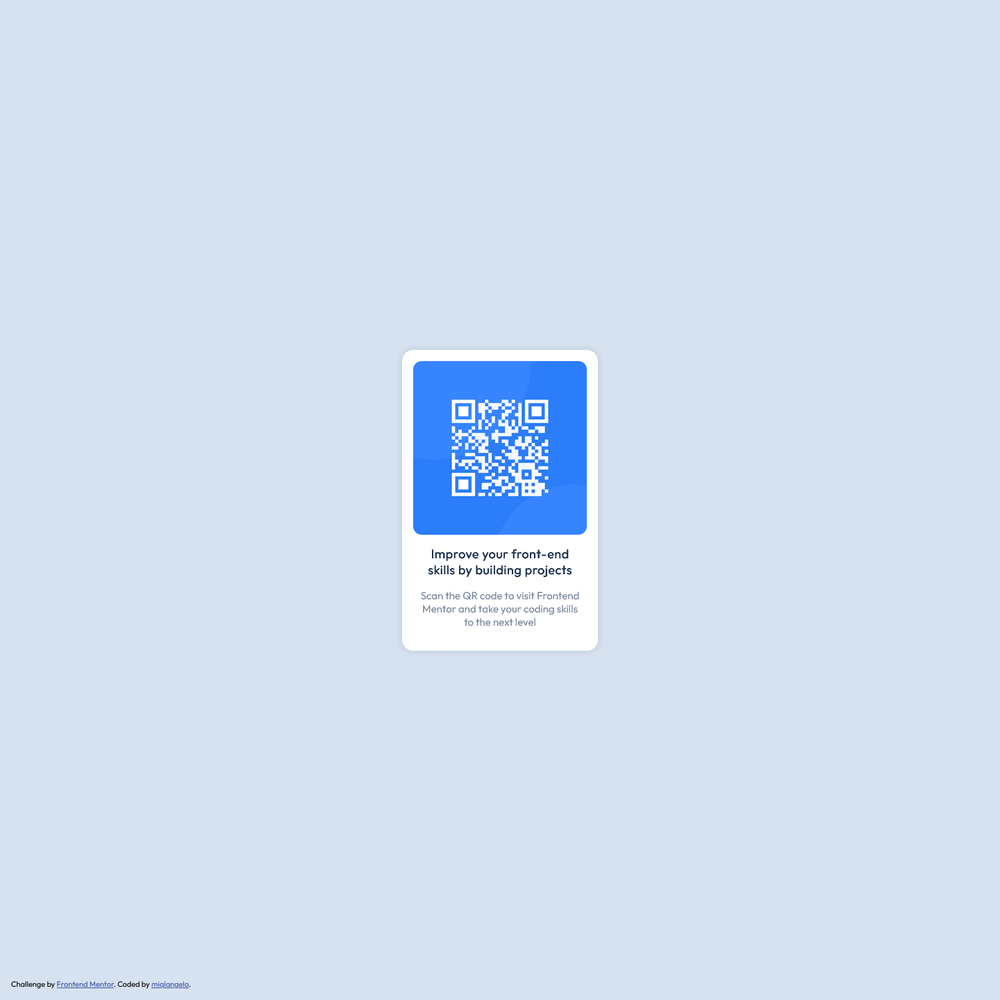

# Frontend Mentor - QR code component solution

This is a solution to the [QR code component challenge on Frontend Mentor](https://www.frontendmentor.io/challenges/qr-code-component-iux_sIO_H). Frontend Mentor challenges help you improve your coding skills by building realistic projects.

## Table of contents

-   [Screenshots](#screenshot)
-   [Built with](#built-with)
-   [Author](#author)

## Screenshots

## Built with

-   Semantic HTML5 markup
-   CSS custom properties
-   Flexbox

## Author

-   Frontend Mentor - [@miqlangelo](https://www.frontendmentor.io/profile/miqlangelo)
-   LinkedIn - [miqlangelo](https://www.linkedin.com/in/miqlangelo/)
